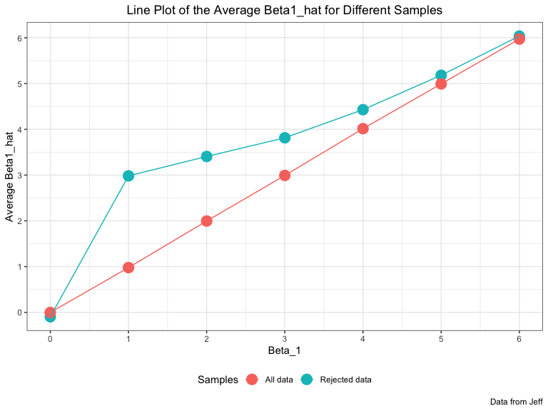

p8105\_hw5\_jz3183
================
Jungang Zou
11/2/2019

# Homework 5 for Data Science Course p8105

## Problem 1

First, we read the data.

``` r
# In this code chunk, we will read the dataset iris
iris_with_missing = 
  iris %>% 
  map_df(~replace(.x, sample(1:150, 20), NA)) %>%
  mutate(Species = as.character(Species))

# display
iris_with_missing
## # A tibble: 150 x 5
##    Sepal.Length Sepal.Width Petal.Length Petal.Width Species
##           <dbl>       <dbl>        <dbl>       <dbl> <chr>  
##  1          5.1         3.5          1.4         0.2 setosa 
##  2          4.9         3            1.4         0.2 setosa 
##  3          4.7         3.2          1.3         0.2 setosa 
##  4          4.6         3.1          1.5        NA   setosa 
##  5          5           3.6          1.4         0.2 setosa 
##  6          5.4         3.9          1.7         0.4 setosa 
##  7         NA           3.4          1.4         0.3 setosa 
##  8          5           3.4          1.5         0.2 setosa 
##  9          4.4         2.9          1.4         0.2 setosa 
## 10          4.9         3.1         NA           0.1 setosa 
## # … with 140 more rows
```

Then, we need to write 1 function to fill the missing values according
to the following rules:

  - For numeric variables, you should fill in missing values with the
    mean of non-missing values
  - For character variables, you should fill in missing values with
    “virginica”

In the next code chunk, I write a function to fill the missing value and
display the
data.

``` r
# in this code chunk, we write a function "fill_missing" and use "map_df" to fill the missing data. 
fill_missing = function(vec) {
  if (!is.vector(vec)) {
    stop("The input is not a vector")
  }
  if (is.numeric(vec)) {
    vec = 
      vec %>% 
      replace_na(mean(vec[!is.na(vec)]))
  } else if (is.character(vec)) {
    vec = 
      vec %>% 
      replace_na("virginica")
  }
  vec
}

# fill the missing data
iris_without_missing <- map_df(.x = iris_with_missing, ~ fill_missing(.x))

# display
iris_without_missing
## # A tibble: 150 x 5
##    Sepal.Length Sepal.Width Petal.Length Petal.Width Species
##           <dbl>       <dbl>        <dbl>       <dbl> <chr>  
##  1         5.1          3.5         1.4         0.2  setosa 
##  2         4.9          3           1.4         0.2  setosa 
##  3         4.7          3.2         1.3         0.2  setosa 
##  4         4.6          3.1         1.5         1.19 setosa 
##  5         5            3.6         1.4         0.2  setosa 
##  6         5.4          3.9         1.7         0.4  setosa 
##  7         5.82         3.4         1.4         0.3  setosa 
##  8         5            3.4         1.5         0.2  setosa 
##  9         4.4          2.9         1.4         0.2  setosa 
## 10         4.9          3.1         3.77        0.1  setosa 
## # … with 140 more rows
```

## Problem 2

In this problem, we need to firstly read datasets from local files
according to the process:

  - Start with a dataframe containing all file names; the list.files
    function will help
  - Iterate over file names and read in data for each subject using
    purrr::map and saving the result as a new variable in the dataframe
  - Tidy the result; manipulate file names to include control arm and
    subject ID, make sure weekly observations are “tidy”, and do any
    other tidying that’s necessary

<!-- end list -->

``` r
# In this code chunk, we will read the datasets

# read the file names for all datasets
dataset_name = 
  list.files("./dataset_p2/data", pattern = "^.+_.+.csv$") %>% 
  as.data.frame() %>% 
  map_dfc(.x = ., ~paste("./dataset_p2/data", ., sep = "/")) %>%              # add path
  rename("file_name" = ".")

# display
dataset_name
## # A tibble: 20 x 1
##    file_name                   
##    <chr>                       
##  1 ./dataset_p2/data/con_01.csv
##  2 ./dataset_p2/data/con_02.csv
##  3 ./dataset_p2/data/con_03.csv
##  4 ./dataset_p2/data/con_04.csv
##  5 ./dataset_p2/data/con_05.csv
##  6 ./dataset_p2/data/con_06.csv
##  7 ./dataset_p2/data/con_07.csv
##  8 ./dataset_p2/data/con_08.csv
##  9 ./dataset_p2/data/con_09.csv
## 10 ./dataset_p2/data/con_10.csv
## 11 ./dataset_p2/data/exp_01.csv
## 12 ./dataset_p2/data/exp_02.csv
## 13 ./dataset_p2/data/exp_03.csv
## 14 ./dataset_p2/data/exp_04.csv
## 15 ./dataset_p2/data/exp_05.csv
## 16 ./dataset_p2/data/exp_06.csv
## 17 ./dataset_p2/data/exp_07.csv
## 18 ./dataset_p2/data/exp_08.csv
## 19 ./dataset_p2/data/exp_09.csv
## 20 ./dataset_p2/data/exp_10.csv


# read dataset as a dataframe and create a variable "file_data" to save the data
nest_data = 
  dataset_name %>% 
  # create a variable named file_data to denote the nested data
  mutate("file_data" = purrr::map(.x = pull(., file_name), read_csv))        # read data
  
# display
nest_data  
## # A tibble: 20 x 2
##    file_name                    file_data       
##    <chr>                        <list>          
##  1 ./dataset_p2/data/con_01.csv <tibble [1 × 8]>
##  2 ./dataset_p2/data/con_02.csv <tibble [1 × 8]>
##  3 ./dataset_p2/data/con_03.csv <tibble [1 × 8]>
##  4 ./dataset_p2/data/con_04.csv <tibble [1 × 8]>
##  5 ./dataset_p2/data/con_05.csv <tibble [1 × 8]>
##  6 ./dataset_p2/data/con_06.csv <tibble [1 × 8]>
##  7 ./dataset_p2/data/con_07.csv <tibble [1 × 8]>
##  8 ./dataset_p2/data/con_08.csv <tibble [1 × 8]>
##  9 ./dataset_p2/data/con_09.csv <tibble [1 × 8]>
## 10 ./dataset_p2/data/con_10.csv <tibble [1 × 8]>
## 11 ./dataset_p2/data/exp_01.csv <tibble [1 × 8]>
## 12 ./dataset_p2/data/exp_02.csv <tibble [1 × 8]>
## 13 ./dataset_p2/data/exp_03.csv <tibble [1 × 8]>
## 14 ./dataset_p2/data/exp_04.csv <tibble [1 × 8]>
## 15 ./dataset_p2/data/exp_05.csv <tibble [1 × 8]>
## 16 ./dataset_p2/data/exp_06.csv <tibble [1 × 8]>
## 17 ./dataset_p2/data/exp_07.csv <tibble [1 × 8]>
## 18 ./dataset_p2/data/exp_08.csv <tibble [1 × 8]>
## 19 ./dataset_p2/data/exp_09.csv <tibble [1 × 8]>
## 20 ./dataset_p2/data/exp_10.csv <tibble [1 × 8]>

# tidy the nest_data
df_p2 = 
  nest_data %>% 
  mutate(file_name = str_extract(file_name, "[conexp]{3}_[0-9]{2}")) %>%     # delete ".csv" in file names
  separate(file_name, into = c("arm", "subject_id"), sep = "_") %>%          # seperate filename into arm and id
  mutate(arm = str_replace(arm, "con", "control"), arm = str_replace(arm, "exp", "experimental")) %>% 
  #mutate(subject_id = as.numeric(subject_id)) %>%                            # convert id into numeric
  unnest(cols = "file_data")                                                  # unnest
  

# display
df_p2
## # A tibble: 20 x 10
##    arm   subject_id week_1 week_2 week_3 week_4 week_5 week_6 week_7 week_8
##    <chr> <chr>       <dbl>  <dbl>  <dbl>  <dbl>  <dbl>  <dbl>  <dbl>  <dbl>
##  1 cont… 01           0.2  -1.31    0.66   1.96   0.23   1.09   0.05   1.94
##  2 cont… 02           1.13 -0.88    1.07   0.17  -0.83  -0.31   1.58   0.44
##  3 cont… 03           1.77  3.11    2.22   3.26   3.31   0.89   1.88   1.01
##  4 cont… 04           1.04  3.66    1.22   2.33   1.47   2.7    1.87   1.66
##  5 cont… 05           0.47 -0.580  -0.09  -1.37  -0.32  -2.17   0.45   0.48
##  6 cont… 06           2.37  2.5     1.59  -0.16   2.08   3.07   0.78   2.35
##  7 cont… 07           0.03  1.21    1.13   0.64   0.49  -0.12  -0.07   0.46
##  8 cont… 08          -0.08  1.42    0.09   0.36   1.18  -1.16   0.33  -0.44
##  9 cont… 09           0.08  1.24    1.44   0.41   0.95   2.75   0.3    0.03
## 10 cont… 10           2.14  1.15    2.52   3.44   4.26   0.97   2.73  -0.53
## 11 expe… 01           3.05  3.67    4.84   5.8    6.33   5.46   6.38   5.91
## 12 expe… 02          -0.84  2.63    1.64   2.58   1.24   2.32   3.11   3.78
## 13 expe… 03           2.15  2.08    1.82   2.84   3.36   3.61   3.37   3.74
## 14 expe… 04          -0.62  2.54    3.78   2.73   4.49   5.82   6      6.49
## 15 expe… 05           0.7   3.33    5.34   5.57   6.9    6.66   6.24   6.95
## 16 expe… 06           3.73  4.08    5.4    6.41   4.87   6.09   7.66   5.83
## 17 expe… 07           1.18  2.35    1.23   1.17   2.02   1.61   3.13   4.88
## 18 expe… 08           1.37  1.43    1.84   3.6    3.8    4.72   4.68   5.7 
## 19 expe… 09          -0.4   1.08    2.66   2.7    2.8    2.64   3.51   3.27
## 20 expe… 10           1.09  2.8     2.8    4.3    2.25   6.57   6.09   4.64
```

After tidy the data, we will make a spaghetti plot showing observations
on each subject over time:

``` r
# in this code chunk, we will make a spaghetti plot

df_p2 %>% 
  # transform the data to make plot
  pivot_longer(
    cols = week_1:week_8,
    names_to = "week",
    names_prefix = "week_",
    values_to = "value"
  ) %>% 
  # draw spaghetti plot
  ggplot(aes(x = week, y = value, color = subject_id)) +
  geom_line(aes(x = week, y = value, group = subject_id)) +
  facet_grid(.~arm) +
  labs(
    title = "Spaghetti Plot for Arms in Differet Weeks",
    x = "Week",
    y = "Value",
    caption = "Data from URL: https://p8105.com/data/hw5_data.zip") +
  theme(plot.title = element_text(hjust = 0.5))
```


From the spaghetti graph, we may draw the conclusion that the values of
control arm are nearly kept during 8 weeks. However, the values of
experimental arm are increased during 8 weeks. This result may show that
the experiment can make a difference during the time.

## Problem 3

In the problem, we are asked to do simulation on linear regression with
the following parameters:

  - Fix \(n = 30\)
  - Fix \(x_{i1}\) as draws from a standard Normal distribution
  - Fix \(\beta_0 = 2\)
  - Fix \(\sigma^2 = 50\)

During the simulations, we will set \(\beta_{1} = 0\) firstly, and
change its value from 1 to 6 to do the simulations.

``` r
# in this code chunk I run the simulation 10000 times for each beta_1

# simulation function
sim_regression = function(beta_1 = 0) {
  # set parameters 
  n = 30
  beta_0 = 2
  sigma = 50
  
  # set variables
  sim_data = tibble(
    x = rnorm(n, mean = 0, sd = 1),
    y = beta_0 + beta_1 * x + rnorm(n, 0, sqrt(sigma))
  )
  
  # regression
  ls_fit = lm(y ~ x, data = sim_data)
  lm_result = broom::tidy(ls_fit)
  
  # return the results of beta1_hat
  tibble(
    beta1_hat = lm_result[[2, "estimate"]],
    p_value = lm_result[[2, "p.value"]]
  )
}

sim_results = 
  tibble(beta_1 = 0:6) %>% 
  mutate(beta_1_hat = map(.x = beta_1, ~rerun(10000, sim_regression(beta_1 = .x)))) %>%  #simulate
  # unnest
  unnest(cols = "beta_1_hat") %>%   
  unnest(cols = "beta_1_hat")

# display
head(sim_results)
## # A tibble: 6 x 3
##   beta_1 beta1_hat  p_value
##    <int>     <dbl>    <dbl>
## 1      0     2.02  0.207   
## 2      0     1.23  0.182   
## 3      0     0.603 0.606   
## 4      0     3.03  0.000149
## 5      0    -1.19  0.471   
## 6      0    -1.49  0.219
```

After simulation, we will start to draw graph to make some inference.
The first is to make a plot showing the proportion of times the null was
rejected (the power of the test):

``` r
# in this code chunk, we make a plot about power

sim_results %>% 
  # calculate reject_proportion
  mutate(reject = if_else(p_value <= 0.05, TRUE, FALSE)) %>% 
  group_by(beta_1, reject) %>% 
  summarise(reject_proportion = n() / 10000) %>% 
  filter(reject == TRUE) %>% 
  
  # make bar plot
  ggplot(aes(x = beta_1, y = reject_proportion, fill = beta_1)) +
  geom_bar(stat = "identity") +
  scale_x_continuous(
    breaks = c(0, 1, 2, 3, 4, 5, 6)
  ) + 
  labs(
    title = "Bar Plot of the Proportion of Times the Null was Rejected",
    x = "Beta_1",
    y = "Rejection Proportion") +
  theme(plot.title = element_text(hjust = 0.5), legend.position = "none")
```


From the par plot we find with the effect size increase, the power is
also increasing.

Then, I will make 2 plots showing the average estimate of
\(\hat{\beta_1}\):

``` r
# in this code chunk, we make a line plot of beta_1 average 

sim_results %>% 
  # calculate rejection
  mutate(reject = if_else(p_value <= 0.05, TRUE, FALSE)) %>% 
  
  # calculate average on all data
  group_by(beta_1) %>%
  mutate(average_all_beta1_hat = mean(beta1_hat)) %>% 
  ungroup() %>% 
  
  # calculate average on rejected data
  group_by(beta_1, reject) %>% 
  mutate(average_reject_beta1_hat = mean(beta1_hat)) %>% 
  filter(reject) %>% 
  ungroup() %>% 
  
  # data transformation
  select(beta_1, average_reject_beta1_hat, average_all_beta1_hat) %>% 
  distinct() %>% 
  pivot_longer(
    cols = c(average_reject_beta1_hat, average_all_beta1_hat),
    names_to = "average_beta1_hat"
  ) %>% 
  
  # make line plot
  ggplot(aes(x = beta_1, y = value, color = average_beta1_hat)) +
  geom_point(size = 5) +
  geom_line(aes(group = average_beta1_hat)) +
  scale_color_discrete("Samples",labels = c("All data","Rejected data")) +
  scale_x_continuous(
    breaks = c(0, 1, 2, 3, 4, 5, 6)
  ) + 
  scale_y_continuous(
    breaks = c(0, 1, 2, 3, 4, 5, 6, 10, 15, 20)
  ) + 
  labs(
    title = "Line Plot of the Average Beta1_hat for Different Samples",
    x = "Beta_1",
    y = "Average Beta1_hat") +
  theme(plot.title = element_text(hjust = 0.5))
```



From the test we do, we find the sample average of \(\hat{\beta_1}\)
across tests for which the null is rejected gradually equal to the true
value of \(\beta_1\) with the increasing value of \(\beta_1\). On the
other hand, sample average of \(\hat{\beta_1}\) on all data is always
consistent to the true value of \(\beta_1\). The reason is the samples
of \(\hat{\beta_1}\) which can across tests for which the null is
rejected are more likely to be deviated from \(\beta_1 = 0\) when
\(\beta_1 = 0\) is close to 0. However, with the increasing value of
\(\beta_1 = 0\) , more and more samples rejected the null hypothesis,
which makes the average of \(\hat{\beta_1}\) on rejected data closer to
the average of \(\hat{\beta_1}\) on all data.
